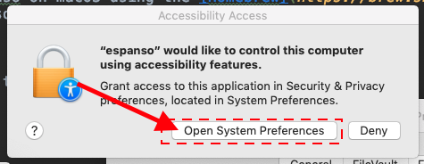
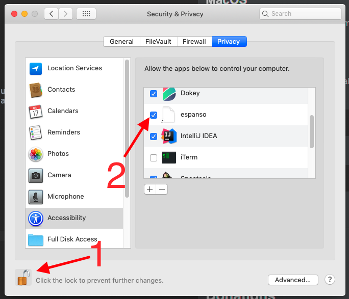

> A cross-platform Text Expander written in Rust


#### What is a Text Expander?

A *text expander* is a program that detects when you type
a specific **keyword** and replaces it with **something else**. 
This is useful in many ways:
* **Save a lot of typing**, expanding common sentences.
* Create **system-wide** code snippets.
* Execute **custom scripts**
* Use **emojis** like a pro.

___

## Key Features

* Works on **Windows**, **macOS** and **Linux**
* Works with almost **any program**
* Works with **Emojis** 😄
* **Date** expansion support
* **Custom scripts** support
* **Shell commands** support
* **App-specific** configurations
* File based configuration

## Table of contents

- [Installation](#installation)
    - [Windows](#install-windows)
    - [Linux](#install-linux)
    - [macOS](#install-macos)
- [FAQ](#faq)
- [Donations](#donations)
- [License](#license)

## Installation

### <a name="install-windows"></a>Windows

TODO

### <a name="install-linux"></a>Linux

TODO

### <a name="install-macos"></a>MacOS

The easiest way to install espanso on macOS using the [Homebrew](https://brew.sh/)
package manager, but you can also do it manually.

#### Using Homebrew

The first thing to do is to add the official espanso *tap* to Homebrew with
the following command:

```
brew tap federico-terzi/espanso
```

Then you can install espanso with:

```
brew install espanso
```

To make sure that espanso was correctly installed, you can open a terminal and type:

```
espanso --version
```

At this point, you have to [Enable Accessibility](#enabling-accessibility) to use espanso.

#### Enabling Accessibility

Because espanso uses the macOS [Accessibility API](https://developer.apple.com/library/archive/documentation/Accessibility/Conceptual/AccessibilityMacOSX/)
to work, you need to authorize it using the following procedure:

Open a terminal and type the command:

```
espanso install
```

A dialog should show up, click on "Open System Preferences", as shown here:



Then, in the "Privacy" panel click on the Lock icon (1) to enable edits and 
then check "espanso" (2), as shown in the picture:



Now open the terminal again and type:

```
espanso install
```

If everything goes well, you should see the espanso icon appear in the status bar:


If you now type `:espanso` in any text field, you should see "Hi there!" appear! 

## FAQ

#### How does espanso work?

TODO

## Donations

espanso is a free, open source software developed in my (little) spare time.
If you liked the project and would like to support further development, 
please consider making a small donation, it really helps :)

[](https://www.paypal.com/cgi-bin/webscr?cmd=_s-xclick&hosted_button_id=FHNLR5DRS267E&source=url)

## License

espanso was created by [Federico Terzi](http://federicoterzi.com)
and is licensed under the [GPL-3.0 license](/LICENSE).